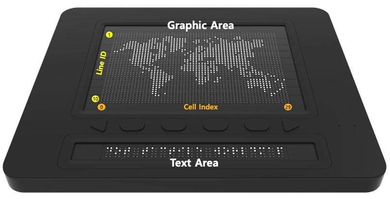

# DotPadSDK 1.0.0 for Python

## Overview

- An Android library for Dot Incorporated's Dot Pad  
- Intended for application development on the Dot Pad device

## SDK Sample Code

- [Sample Application](https://github.com/dotincorp/dotpad-sample-code/tree/main/Python/1.0.0)

## Dot Pad Line ID and Cell Index



## Prerequisites

DotPadSDK was developed using the following environment:

- **Python**: version 3.12.5
- **bleak library**: used for Bluetooth communication

```bash
pip install bleak
```
## SDK Specification

### `DotPadSDK(device: str)`

- Declares the DotPad SDK.
- The parameter `device` is the name of the device to search for.  
  - Default is `"DotPad"`.  
  - If you are using a device named `"DotPad"`, you can use the default value.  
  - If using a simulator, such as an iPad, you may need to modify this parameter.

```python
from SDK import DotPadSDK
sdk = DotPadSDK("DotPad320")
```

### `scan()`
- Scans for the Dot Pad device.
- **Return Value**:  
  - A list of devices if scanning is successful.  
  - Raises an exception if no device is found.
  
```python
from SDK import DotPadSDK
sdk = DotPadSDK("DotPad320")
devices = await sdk.scan()
```

### `connect(device)`
- Connects to the specified Dot Pad device.

```python
connected = await sdk.connect(devices[0])
```

### `disconnect()`
- Disconnects from the Dot Pad device.

```python
await sdk.disconnect("DotPad320")
```

### `add_listener_key_event(deviceName: str, callback: callable)`
- Adds a key event listener to the Dot Pad.
- Provide an **async** callback function as a parameter.

```python
async def key_event_callback(event_code):
    print(f"Key event received: {event_code}")

await sdk.add_listener_key_event(self.device.name, key_event_callback)
```

### `display_graphic_data(deviceName: str, data: str)`
- Prints the graphic data to the Dot Pad’s graphic area.
- The data must be in a hex string converted from 8-bit data.

```python
await sdk.display_graphic_data("DotPad320", "AAFFAF...")
```

### `reset_graphic_data(deviceName: str)`
- Resets the graphic data in the Dot Pad’s graphic area.

```python
await sdk.reset_graphic_data("DotPad320")
```

### `display_pixel_data(deviceName: str, data: str, startRow: int, startIndex: int)`
- Prints the given data to specific lines and cells in the Dot Pad’s graphic area.
- **Parameters**:  
  - `startRow` (0..9)  
  - `startIndex` (0..29)  
  - `data` (Graphic Data in hex string)

```python
await sdk.display_pixel_data("DotPad320", "FFAA", 3, 7) 
# Prints data to the 7th cell of the 3rd line
```

### `display_text_data(deviceName: str, data: str)`
- Prints text data to the Dot Pad’s text area.
- The data must be in a hex string converted from 8-bit data.

```python
await sdk.display_text_data("DotPad320", "AAFFAF...")
```

### `reset_text_data(deviceName: str)`
- Resets the text data in the Dot Pad’s text area.

```python
await sdk.reset_text_data("DotPad320")
```

### `display_text_line_data(deviceName: str, data: str, startIndex: int)`
- Prints the given data to specific cells in the Dot Pad’s text area.
- **Parameters**:  
  - `startIndex` (0..29)  
  - `data` (Graphic Data in hex string)

```python
await sdk.display_text_line_data("DotPad320", "FFAA", 7) 
# Prints data to the 7th cell in the text area
```

