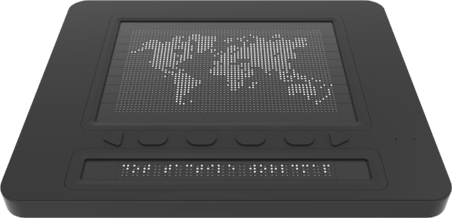

# DotPad SDK Guide

## Overview
* Dot Pad is a tactile display for the visually impaired that can express both text and graphics using Braille.
* The Dot Pad is divided into an area for printing text and Braille and an area for displaying graphics.
* Dot Pad is capable of data communication using Bluetooth BLE and USB C.
* You can develop applications for DotPad through the DotPad SDK.  

  

## SDK Sample Code
* You can test connecting to dotpad and printing by running the sample code.
* [Sample Application](https://github.com/dotincorp/dotpad-sample-code)

## Directory
```
DotPadSDK
├── Android
│   ├── 1.1.0
│   │   ├── DotPadSDK-1.1.0.aar
│   ├── 2.0.0
│   │   └── DotPadSDK-2.0.0.aar
├── iOS
│   ├── 1.2.0
│   │   ├── DotPadSDK-1.2.0.xcframework
│   ├── 2.0.0
│   │   └── DotPadSDK-2.0.0
├── Linux
│   ├── 1.0.0 (in development)
└── Window
    ├── 1.0.0
    │   ├── 32bit
    │   │   ├── DotPadSDK-1.0.0.dll
    │   ├── 64bit
    │   │   └── DotPadSDK-1.0.0.dll
    └── 2.0.0  (in development)
```
