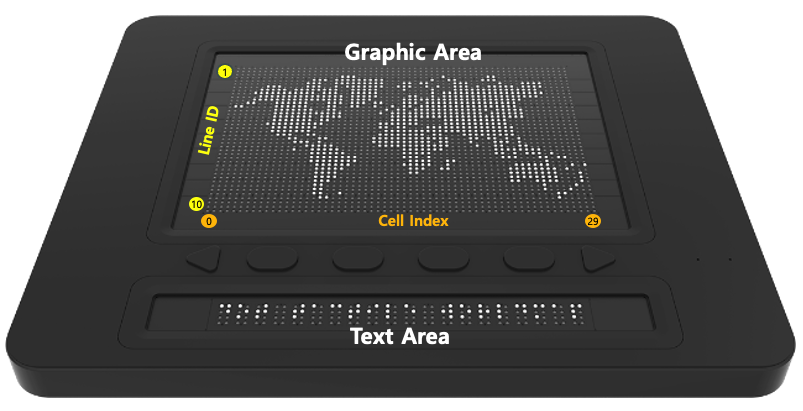

# DotPad SDK Guide

## Overview
* Dot Pad is a tactile display for the visually impaired that can express both text and graphics using Braille.
* The Dot Pad is divided into an area for printing text and Braille and an area for displaying graphics.
* Dot Pad is capable of data communication using Bluetooth BLE and USB C.
* You can develop applications for DotPad through the DotPad SDK.  
  <br>

## Directory
```
├── Android
│   ├── 1.1.0
│   ├── 2.0.0
│   ├── 3.0.0
│   ├── 3.0.1
├── iOS
│   ├── 1.2.0
│   ├── 2.0.0
│   ├── 2.1.0
│   ├── 2.2.0
│   ├── 2.3.0
│   ├── 2.3.1
├── Linux
│   ├── 1.0.0
├── Web
│   ├── 1.0.0
│   ├── 3.0.0
├── Windows
│   ├── 20cell-1.0.12
│   ├── 20cell-1.0.13
│   ├── 1.0.0
│   ├── 1.1.0
│   ├── 1.2.0
│   ├── 1.3.0
│   ├── 1.4.0
│   ├── 3.0.0
```
## Sample code using DotPad SDK
* You can test connecting to dotpad and printing by running the sample code.
