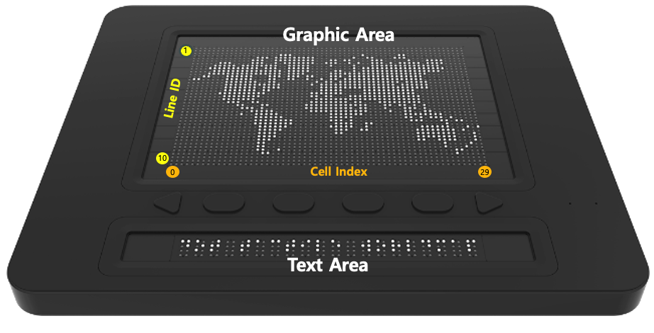

# DotPadSDK API Documentation 1.0.0 for WEB

## Overview

The `DotPadSDK` class provides an interface for managing Bluetooth connections with DotPad devices. It includes methods to request a device, connect to it, disconnect, print data, and listen for device notifications.

<p align="center">
  
  
  
</p>

## Download
  - DotPadSDK-1.0.0.js [<a href="./DotPadSDK-1.0.0.js">download</a>]

## Class & Method

### Constructor
  - Initializes new instances of the DotPad SDK with predefined Bluetooth service and characteristic IDs.
  - Example:
    ```javascript
    const sdk = new DotPadSDK();
    ```

### request()

- Initiates a Bluetooth device request with specific filters and services.
- Returns: A `Promise` resolving to the Bluetooth device requested.
- Example:
  ```javascript
  sdk.request().then(device => console.log(device));
  ```

### connect(device)

- Establishes a connection to a specified Bluetooth device.
- Parameters:
  - `device`: The target device to connect to.
- Returns: A `Promise` resolving to a boolean indicating if the connection was successful.
- Example:
  ```javascript
  sdk.connect(device).then(connected => {
    if (connected) {
      console.log('Device connected successfully');
    }
  });
  ```

### disconnect(device)

- Disconnects a connected Bluetooth device.
- Parameters:
  - `device`: The device to disconnect.
- Returns: A `Promise` that resolves when the device has been disconnected.
- Example:
  ```javascript
  sdk.disconnect(device).then(() => console.log('Device disconnected'));
  ```

### print(device, data, mode)

- Sends data to a connected Bluetooth device for printing.
- Parameters:
  - `device`: The device to print to.
  - `data`: The data to be printed.
  - `mode`: The mode of printing (`graphic` or `text`).
- Returns: A `Promise` that resolves when the data has been sent to the device.
- Example:
  ```javascript
  const printData = "22"; // hex data
  sdk.print(device, printData, 'text');
  ```
### addListenerNotification(device, callbackFunction)

- Registers a callback to listen for notifications from the connected Bluetooth device.
- Parameters:
  - `device`: The device to listen to.
  - `callbackFunction`: The function to call when a notification is received.
- Returns: A `Promise` that resolves when the listener has been added.
- Example:
  ```javascript
  sdk.addListenerNotification(device, notification => console.log(notification));
  ```

## Usage

To utilize the `DotPadSDK`, instantiate the class, connect to a device using `connect()`, and then use `print()` to send data to the device or `addListenerNotification()` to listen for device events.
