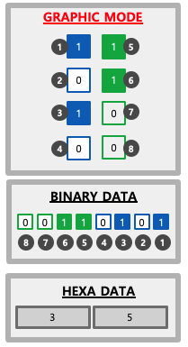

# DotPadSDK API Documentation 1.0.0 for WEB

## Overview

- The `DotPadSDK` class provides an interface for managing Bluetooth connections with DotPad devices. It includes methods to request a device, connect to it, disconnect, print data, and listen for device notifications.
- The Graphic Area consists of 300 cells and the Text Area consists of 20 cells.
- The GRAPHIC MODE data is used for image output, and TEXT MODE data is used for Braille output.

<p align="center">
  
  
  
</p>

## Download
  - DotPadSDK-1.0.0.js [<a href="./DotPadSDK-1.0.0.js">download</a>]

## Class & Method

### Constructor
  - Initializes new instances of the DotPad SDK with predefined Bluetooth service and characteristic IDs.
  - Example:
    ```javascript
    const sdk = new DotPadSDK();
    ```

### request()
- Initiates a Bluetooth device request with specific filters and services.
- Returns: A `Promise` resolving to the Bluetooth device requested.
- Example:
  ```javascript
  sdk.request().then(device => console.log(device));
  ```

### connect(device)
- Establishes a connection to a specified Bluetooth device.
- Parameters:
  - `device`: The target device to connect to.
- Returns: A `Promise` resolving to a boolean indicating if the connection was successful.
- Example:
  ```javascript
  sdk.connect(device).then(connected => {
    if (connected) {
      console.log('Device connected successfully');
    }
  });
  ```

### disconnect(device)
- Disconnects a connected Bluetooth device.
- Parameters:
  - `device`: The device to disconnect.
- Returns: A `Promise` that resolves when the device has been disconnected.
- Example:
  ```javascript
  sdk.disconnect(device).then(() => console.log('Device disconnected'));
  ```

### displayGraphicData(device, hexData)
- Sends hexadecimal data to print the graphics area at once.
- Parameters:
  - `device`: The connected DotPad device.
  - `hexData`: Hexadecimal string representing the GRAPHIC MODE data.
- Example:
  ```javascript
  sdk.displayGraphicData(device, 'hex data here');
  ```

### displayGraphicLineData(device, lineId, cellIndex, hexData)
- Sends hexadecimal data to print partial the graphic area, starting at a specific line ID and cell index
- Parameters:
  - `device`: The connected DotPad device.
  - `lineId`: The DotPad line index (1-10).
  - `cellIndex`: The DotPad cell index (0-29).
  - `hexData`: Hexadecimal string representing the partial GRAPHIC MODE data.
- Example:
  ```javascript
  sdk.displayGraphicLineData(device, 1, 5, 'hex data here');
  ```

### resetGraphicData(device)
- Resets the entire graphic area (300 cells) of the DotPad to a default state.
- Parameters:
  - `device`: The connected DotPad device.
- Example:
  ```javascript
  sdk.resetGraphicData(device);
  ```

### displayTextData(device, hexData)
- Sends Braille hex data to the text area (20 cells) of the DotPad and handles data wrapping.
- Parameters:
  - `device`: The connected DotPad device.
  - `hexData`: Hexadecimal string representing the TEXT MODE data.
- Example:
  ```javascript
  sdk.displayTextData(device, 'braille hex data here');
  ```  
  
### resetTextData(device)
- Clears the text area of the DotPad, resetting it to a blank state.
- Parameters:
  - `device`: The connected DotPad device.
- Example:
  ```javascript
  sdk.resetTextData(device);
  ```  

### addListenerKeyEvent(device, callbackFunction)
- Registers a callback function to handle key event notifications from the DotPad.
- Parameters:
  - `device`: The connected DotPad device.
  - `callbackFunction`: Function to execute key event notification.
- keyCode:  
  - Panning Key : P1, P2
  - Functio Key : F1, F2, F3, F4
- Example:
  ```javascript
  sdk.addListenerKeyEvent(device, function(keyCode) {
    console.log('Key code:', keyCode);
  });
  ```  